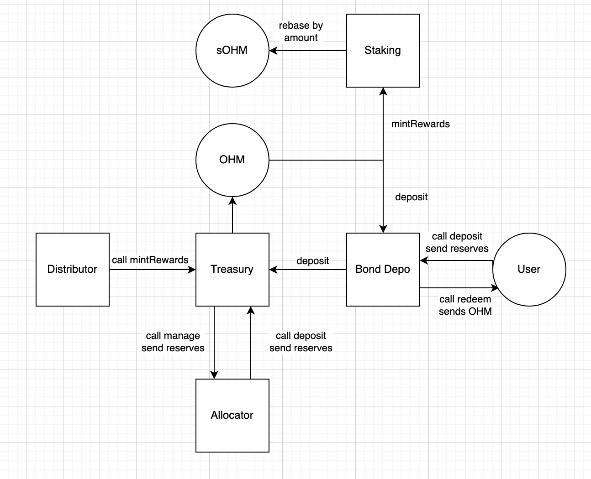

# Ω PenDao Smart Contracts


##  🔧 Setting up Local Development
Required: 
- [Node v14](https://nodejs.org/download/release/latest-v14.x/)  
- [Git](https://git-scm.com/downloads)


Local Setup Steps:
1. git clone https://github.com/PenDaoDAO/pendao-contracts.git 
1. Install dependencies: `npm install` 
    - Installs [Hardhat](https://hardhat.org/getting-started/) & [OpenZepplin](https://docs.openzeppelin.com/contracts/4.x/) dependencies
1. Compile Solidity: `npm run compile`
1. **_TODO_**: How to do local deployments of the contracts.


## 🤨 How it all works


## Mainnet Contracts & Addresses


**Bonds**
- **_TODO_**: What are the requirements for creating a Bond Contract?
All LP bonds use the Bonding Calculator contract which is used to compute RFV. 

|Contract       | Addresss                                                                                                            | Notes   |


### Testnet Addresses


## Allocator Guide

The following is a guide for interacting with the treasury as a reserve allocator.

A reserve allocator is a contract that deploys funds into external strategies, such as Aave, Curve, etc.

Treasury Address: ``

**Managing**:
The first step is withdraw funds from the treasury via the "manage" function. "Manage" allows an approved address to withdraw excess reserves from the treasury.

*Note*: This contract must have the "reserve manager" permission, and that withdrawn reserves decrease the treasury's ability to mint new PEN (since backing has been removed).

Pass in the token address and the amount to manage. The token will be sent to the contract calling the function.

```
function manage( address _token, uint _amount ) external;
```

Managing treasury assets should look something like this:
```
treasury.manage( DAI, amountToManage );
```

**Returning**:
The second step is to return funds after the strategy has been closed.
We utilize the `deposit` function to do this. Deposit allows an approved contract to deposit reserve assets into the treasury, and mint PEN against them. In this case however, we will NOT mint any PEN. This will be explained shortly.

*Note* The contract must have the "reserve depositor" permission, and that deposited reserves increase the treasury's ability to mint new PEN (since backing has been added).


Pass in the address sending the funds (most likely the allocator contract), the amount to deposit, and the address of the token. The final parameter, profit, dictates how much PEN to send. send_, the amount of PEN to send, equals the value of amount minus profit.
```
function deposit( address _from, uint _amount, address _token, uint _profit ) external returns ( uint send_ );
```

To ensure no PEN is minted, we first get the value of the asset, and pass that in as profit.
Pass in the token address and amount to get the treasury value.
```
function valueOf( address _token, uint _amount ) public view returns ( uint value_ );
```

All together, returning funds should look something like this:
```
treasury.deposit( address(this), amountToReturn, DAI, treasury.valueOf( DAI, amountToReturn ) );
```
